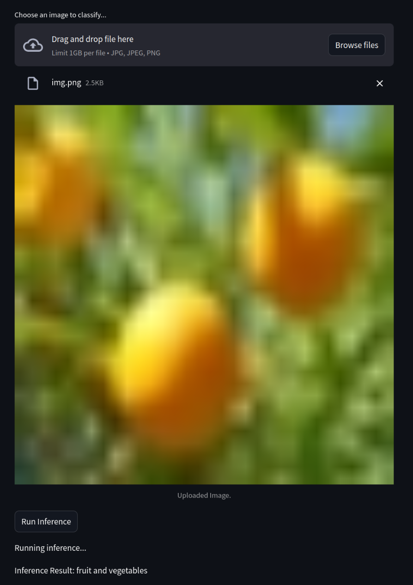

# PMLDL MLOps assignment

A project to showcase model deployment using Flask and Streamlit

## Problem

I chose an image classification problem for this task. Specifically, I used CIFAR-100 dataset to train Effnet-b2 model. Due to computational limitations, I only trained for 10 epochs. However, I managed to achieve accuracy of 0.88. 

## Dataset used
[CIFAR-100 (course classes)](https://www.kaggle.com/datasets/fedesoriano/cifar100/data)

## Model used
[Effnet-b2](https://huggingface.co/google/efficientnet-b2)

## Metrics
Accuracy: 0.88

## Demo Streamlit app



## Flask backend routes

# How to start
Everything runs via docker compose
```
docker compose up 
```

## Streamlit
Got `localhost:3000` for Streamlit

## Flask
Currenly, only one route is avaliable

`POST /classify`

Here's an example curl command

```
curl --location 'localhost:8000/classify' \
--form 'image=@"/path/to/img.png"'
```

Any PIL compatable image works

Output in the class of the image
